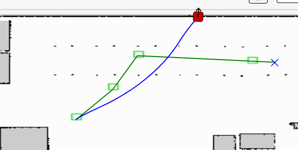
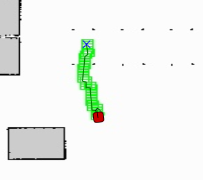
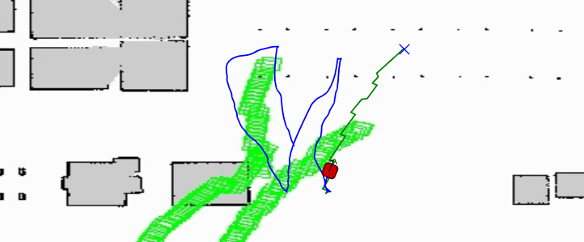
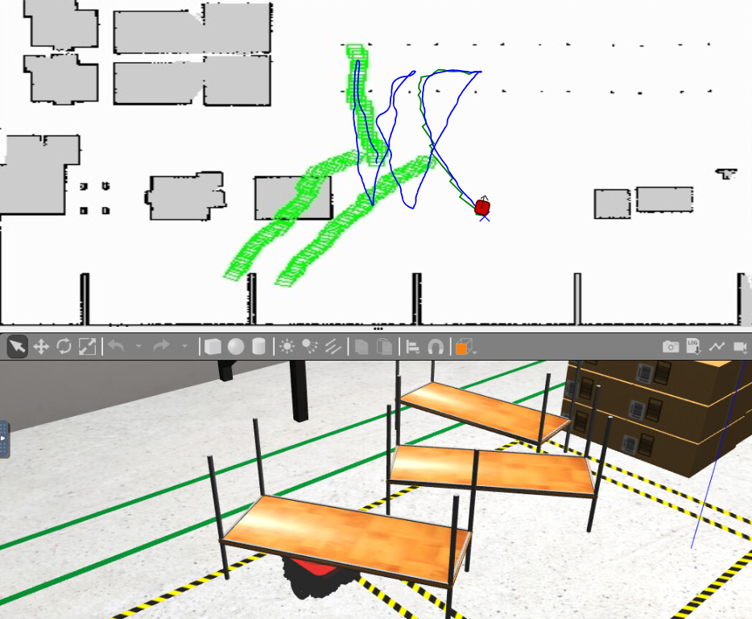

## AMAZON WEREHOUSE

The objective of this practice is to implement the logic that allows a logistics robot to deliver shelves to the required place by making use of the location of the robot. The robot is equipped with a map and knows its current location in it. The main objective will be to find the shortest path to complete the task.

Another goal is to leran how to use the *OMPL* library.

## PLANING

To start planing I need to get the conversion of the coordinate from *3D* to *2D*. This time the exercise give us all the measurements of the map in both spaces. Once the transformation is correct is time to learn wich functionas of *OMPL* I have to use and what does each one.

Using the example from the documentation I can try to define the start point and the objetive coordinates to try the planner. The early tests show incorrect paths due to *OPML* use the X and Y coordinates the other way around, so where I use the X coordinate I have to use the Y, and vice versa.

<p align="center">
  
  
</p>

## PLAN EXECUTION

Once the path is complete the robot can start moving. For a good navigation I implemented a PID control over angular and linear speed and I use a simple *finite state machine* that use three states:

1. INIT: variables are initialized.
2. TURN: robot turn until it reaches the correct yaw. Only angular speed.
3. FORWARD: to move forward. In this state is controled both angular and linear speed.

```python
def vel_w_PID(error_yaw, integral_w, last_error_w):
    
    diff_w = error_yaw - last_error_w
    integral_w += error_yaw
    w = KP_W * error_yaw + KI_W * integral_w + KD_W * diff_w
    w = max(-MAX_W, min(MAX_W, w))
    last_error_w = error_yaw

    return w

def vel_v_PID(pose, next_xy, dist, last_error_v):
    real_current = [pose.x, pose.y]
    real_target = convert2Dto3D(next_xy[0], next_xy[1])
    dist = euclid_distance(real_current, real_target)

    error_v = dist
    diff_v = error_v - last_error_v
    v = KP_V * error_v + KD_V * diff_v
    v = max(0, min(MAX_V, v))
    last_error_v = error_v

    return v
```

> Speed controll fuctions

Once the robot reaches the objetive it can start the second planing now with the shelf geometry. It uses the same movement. I wanted to make multiple functions but due to a failure in the task, the main loop is bigger than expected, making it a bit difficult to read.

To be able to move more than one shelf I created a the variable `track` wich has two posible values: *"IDA"* or *"VUELTA"*. For each value the code behave different.

After facing several errors and problems, I have managed to implement a solution that can move several shelves. The next image shows a execution of this solution (it has an error in the `draw_square()` function). 

<center>
    
</center>

<center>
    
</center>

## VIDEO

* Execution without replaning or shelf:

[]("Amazon Werehouse")

> Youtube URL if not displayed: [https://youtu.be/wypbBwd2t1M](https://youtu.be/wypbBwd2t1M)

* First execution with shelf

[]("Amazon Werehouse")

> Youtube URL if not displayed: [https://youtu.be/YEc3RShJj7A](https://youtu.be/YEc3RShJj7A)

* Complete execution of the code whit three shelves:

[]("Amazon Werehouse")

> Youtube URL if not displayed: [https://youtu.be/2FU1XOK2g2U](https://youtu.be/2FU1XOK2g2U)

## ERRORS FACED AND POSIBLE UPGRADES

#### ERRORS and PROBLEMS

1. If an execution end with the platform up, it stays up for the next execution. To avoid this, I used *sleep* before the `HAL.putdown()` function to give it time to put down the platform before any other code is executed.
2. The planner in some executions didn't get the correct goal. It was fixed by changin the parameters of the `plan()`function.
3. Some coordinates are not precise enough, so I had to chage them by eye to get a correct positioning of the robot. (As seen in the last video isn't always a good solution)

#### POSSIBLE UPGRADES

1. Optimization of the code by split it in more functions.
2. A more smooth aproximation of the robot at the shelves to avoid to lose the shelf or to get a wrong orientation of it.
3. Better obstacle recognition.
4. As seen in the last video, the squares for debugging aren't correctly painted. This should be fixed.
5. Take better measures to get a correct position and coordinates for the shelves that are being moved.