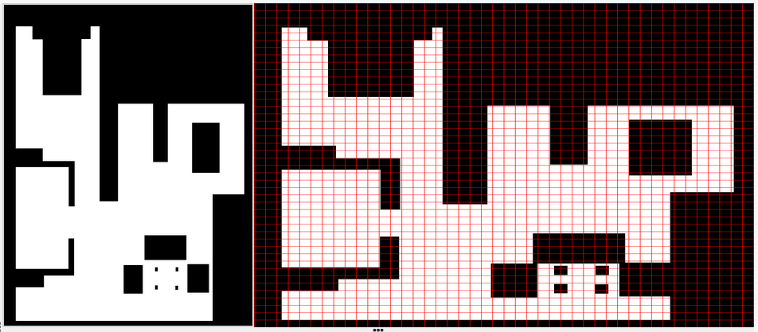

# Localized Vacuum Cleaner

The first practice has the goal to to implement the logic of a navigation algorithm for an autonomous vacuum cleaner by making use of the location of the robot. The robot is equipped with a map and knows it’s current location in it. The main objective will be to cover the largest area of ​​a house using the programmed algorithm.

The algorithm chosed for this job is *BSA: Backtracking Spiral Algorithm*

### Localization

First thing I need is to relate the **3D** coordinates from *Gazebo* to the 2D map. The best way to do this is first work with the image, creating the grid I will use later. Once the grid is created by transform the array of the map into a matrix, I can start to get points.

This was the fist Grid I created, but after a check of the documentation I saw that dimmension bigger than 1000x1000 may affect perfonmance, so I decided to resiz my matrix once I get it from the image.

* First matrix with dimensions 1012x1013:
  

    

* Second atemp with a dimension of 506x506
> This value is the half rounded down of the original

    

To get the coordinates I need to calcule using this ecuation:

    

Now I have to get some points to calculate the different values. For the *scale* I can chose 2 points with the same coordinate X or Y and the get the **3D** pose.

The grid is made with squares of 17x17 pixels, thanks to know this I can get a better approach. I chose the **3D** points (4.06, -1.05) and (2.70, -1.05). This two points are the **2D** points (85,153) and (153, 153). To get the *scale* I made the mean of the pair of coordinates. I get the follow:

* 1.36 meters of difference in the X **3D** coordinate
* 68 pixels from the X **2D** coordinate

Now I can calculate the scale, wich has a value of 52 measures of the map are 1 meter on the simulation
> All measurements has been aproached

Once I have all the data, I can use the ecuation to convert **2D** coordinates to the **3D**.

### BSA

The next step is to start with the algorithm and the planning of the route. 
