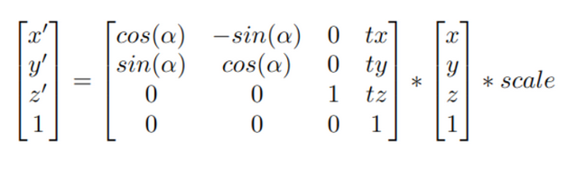
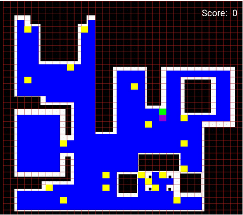

## Localized Vacuum Cleaner

The first practice has the goal to to implement the logic of a navigation algorithm for an autonomous vacuum cleaner by making use of the location of the robot. The robot is equipped with a map and knows it’s current location in it. The main objective will be to cover the largest area of ​​a house using the programmed algorithm.

The algorithm chosed for this job is *BSA: Backtracking Spiral Algorithm*

### Localization

First thing I need is to relate the **3D** coordinates from *Gazebo* to the 2D map. The best way to do this is first work with the image, creating the grid I will use later. Once the grid is created by transform the array of the map into a matrix, I can start to get points.

I decided to use the original size of the matrix because is more easy to work with it.

* Matrix with dimensions 1012x1012:
  
<center>
    
</center>

To get the coordinates I need to calcule using this ecuation:

<center>
    
</center>

Now I have to get some points to calculate the different values. For the *scale* I can chose 2 points with the same coordinate X or Y and the get the **3D** pose.

The grid is made of *30x30* squares, but it can be changed in the code. This allow to try other sizes or other maps, and adapt the solution to avoid obstacles. The data value used for the transformation matrix:

* TX = 4.07 , TY = 5.65
* SCALE = 101.7

> All measurements has been aproached for the original map of this practice.

Once I have all the data, I can use the ecuation to convert **2D** coordinates to the **3D**.

### BSA

The next step is to start with the algorithm and the planning of the route. To start the planing I need to get the initial position of the robot and search for the nearest cell, wich will be my *Initial_cell*. To do this, I get the actual **2D** coordinate using the previous transformation matrix:

```python
def convert3Dto2D(x, y):
    transformation = np.array([[0, 1, 0, TX], [-1, 0, 0, TY], [0, 0, 1, 0], [0, 0, 0, 1]])
    real_pose = np.array([x, y, 0, 1])
    map_2d_pose = np.dot(transformation, real_pose) * SCALE
    return map_2d_pose[0], map_2d_pose[1]
```

With the coordinate I can make the euclidean distance among my valid centers and the robot position and choose the nearest as the Initial cell.

```python
def euclid_distance(punto1, punto2):
    return math.sqrt((punto1[0] - punto2[0])**2 + (punto1[1] - punto2[1])**2)
    
def found_init_point(point, centers):
    init_point = min(centers, key=lambda center: euclid_distance(point, center))
    return init_point
```

Now that I have the first cell of the Gridmap, I can start the real planing of the route. The directions to follow will be **North, Est, South, West**, in that order of preference. I have to implement the algorith that follow the directions and mark the cells as visited. At the same time I need to keep the free nearest point as a return point for when the robot is unable to move because is surrounded by visited cells, but it still has point that weren't visited from the *valid_centers* list.

The first aproach of the planning looks like this:

<center>
    
</center>

The blue cells are the valid cells the robot can clean. The yellow ones are the returning points for the robot when there aren't valid moves but there're still points in the *valid_centers* list. Violet is the initial cell. When the robot visit a cell that one is painted green.

To create a path between return_points and critic_points, I use the simpliest algorithm posible, **BFS**, wich is easy to implement in python.

```python
def bfs_path(actual_point, next_point, point_list):
    if actual_point not in point_list or next_point not in point_list:
        return None, None

    visited = set()
    frontier = [actual_point]
    parent = {actual_point: None}
    yaw_from = {actual_point: None}

    directions = [
        ((-SQUARE_PIXELS, 0), -math.pi/2),  # Norte
        ((0, SQUARE_PIXELS), -math.pi),     # Este
        ((SQUARE_PIXELS, 0), math.pi/2),    # Sur
        ((0, -SQUARE_PIXELS), 0.0)          # Oeste
    ]

    while frontier:
        current = frontier.pop(0)

        if current == next_point:

            path = []
            yaws = []
            while current is not None:
                path.append(current)
                yaws.append(yaw_from[current])
                current = parent[current]
            return path[::-1], yaws[::-1]

        visited.add(current)

        for (dy, dx), yaw in directions:
            neighbor = (current[0] + dy, current[1] + dx)
            if neighbor in point_list and neighbor not in visited and neighbor not in frontier:
                frontier.append(neighbor)
                parent[neighbor] = current
                yaw_from[neighbor] = yaw

    return None, None
```

This function was created before the 'crate_route()' function, because of that, I had to make the algorithm to adapt to the function. This can be seen in the *return*, wich always has two arguments: path and the respective yaw of every cell.

### Movement

Once I have the path I can start to implement the movement. To have a smooth aproach to the different cells I have to use a PID controler for both linear and angular velocity. I choose to use the simpliest *FSM* posible with an initial state and two states that are *TURN* and *FORWARD*. The steps used in the navigation:

1. I get the initial cell and the next one. I then go to *TURN* state.
2. The robot is oriend to the next cell.
3. Once oriented, the robot move forwrd to the cell.
4. When the next_cell is reached (with a tolerance that can be changed), the the previous next cell become the current, and the next is taken from the path.
5. If the next cell has a yaw different from the actual, the state change to *TURN* to orient the robot to the new cell.
6. This loop continue untill all the path is visited.


### Errors

I have corrected various errors from the previous version of the exercise. The most significant:

* The size of the map and the cells. In the old version I resized the map, but in this one I decided to use it at original size.

* Transform matrix. I was unable to get the correct transformation matrix all over the exercise. At the time of start to move, the *3D* to *2D* coordinates didn't grow and decrease as expected. Due to this, the robot did never arived to the next cell.

* During the phase of debuging the map, the initial cell sometimes didn't get painted, this was becaus the transformation of 3D to 2D that was incorrect.

* The movement was incorrect. Now It use PID for linear and angular. In the previous version this was made it in separated function, but now is in the main loop (a good practice would be make this in functions again)

### Execution

I recomend to watch the videos in x1.5 or x2 speed. DUe to my computer specifications, is not enough powerful and sometimes the docker stop the execution of the exercise. I tried to record the longer execution posible.

[](https://youtu.be/9EDrTPV2Vxs "BSA execution")

[](https://youtu.be/jYdHnbh1gPA "BSA execution 2")


> Youtube URL if not displayed: [https://youtu.be/9EDrTPV2Vxs](https://youtu.be/9EDrTPV2Vxs)

> Youtube URL if not displayed: [https://youtu.be/jYdHnbh1gPA](https://youtu.be/jYdHnbh1gPA)