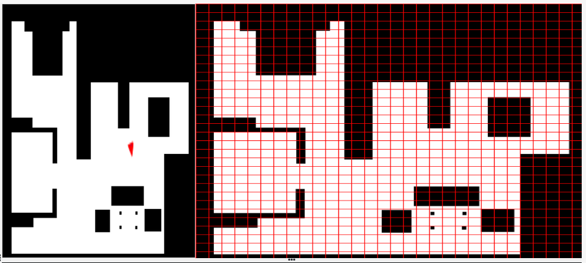

# Localized Vacuum Cleaner

The first practice has the goal to to implement the logic of a navigation algorithm for an autonomous vacuum cleaner by making use of the location of the robot. The robot is equipped with a map and knows it’s current location in it. The main objective will be to cover the largest area of ​​a house using the programmed algorithm.

The algorithm chosed for this job is *BSA: Backtracking Spiral Algorithm*

### Localization

First thing I need is to relate the **3D** coordinates from *Gazebo* to the 2D map. The best way to do this is first work with the image, creating the grid I will use later. Once the grid is created by transform the array of the map into a matrix, I can start to get points.

This was the fist Grid I created, but after a check of the documentation I saw that dimmension bigger than 1000x1000 may affect perfonmance, so I decided to resiz my matrix once I get it from the image.

* First matrix with dimensions 1012x1013:
  
<center>
    
</center>

* Second atemp with a dimension of 506x506
> This value is the half rounded down of the original

<center>
    
</center>

To get the coordinates I need to calcule using this ecuation:

<center>
    
</center>

Now I have to get some points to calculate the different values. For the *scale* I can chose 2 points with the same coordinate X or Y and the get the **3D** pose.

The grid is made with squares of 17x17 pixels, thanks to know this I can get a better approach. I chose the **3D** points (4.06, -1.05) and (2.70, -1.05). This two points are the **2D** points (85,153) and (153, 153). To get the *scale* I made the mean of the pair of coordinates. I get the follow:

* 1.36 meters of difference in the X **3D** coordinate
* 68 pixels from the X **2D** coordinate

Now I can calculate the scale, wich has a value of 52 measures of the map are 1 meter on the simulation
> All measurements has been aproached

Once I have all the data, I can use the ecuation to convert **2D** coordinates to the **3D**.

### BSA

The next step is to start with the algorithm and the planning of the route. To start the planing I need to get the initial position of the robot and search for the nearest cell, wich will be my *Initial_cell*. To do this, I get the actual **2D** coordinate using the previous transformation matrix:

```python
def convert3Dto2D(x, y):
  
    rotation= np.array([ [-1, 0, 0, tx], [0, 1, 0, ty], [0, 0, 1, 0], [0, 0, 0, 1]])

    coordinate = np.array([x, y, 0, 1])
    
    transformed_coord = np.dot(rotation, coordinate) * scale
    
    return transformed_coord
```

With the coordinate I can make the euclidean distance among my valid centers and the robot position and choose the nearest as the Initial cell.

```python
def euclid_distance(punto1, punto2):
    return math.sqrt((punto1[0] - punto2[0])**2 + (punto1[1] - punto2[1])**2)
    
def found_init_point(point, centers):
    init_point = min(centers, key=lambda center: euclid_distance(point, center))
    return init_point
```

Now that I have the first cell of the Gridmap, I can start the real planing of the route. The directions to follow will be **North, Est, South, West**, in that order of preference. I have to implement the algorith that follow the directions and mark the cells as visited. At the same time I need to keep the free nearest point as a return point for when the robot is unable to move because is surrounded by visited cells, but it still has point that weren't visited from the *valid_centers* ist.